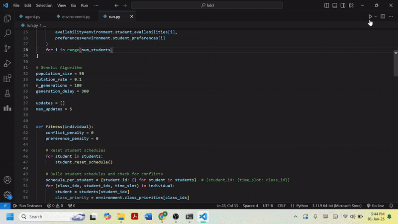

# Lab Task - 3 : Optimization using Genetic Algorithms
This project is a Python-based simulation that uses a Genetic Algorithm to optimize class schedules for students based on their availability, preferences, and class priorities. The solution is visualized in a graphical interface built with Pygame.

## Preview 



## Features
#### Genetic Algorithm Implementation:

* Optimize class assignments to minimize scheduling conflicts and maximize student preferences.
* Incorporates selection, crossover, and mutation to evolve the solution over generations.
#### Visual Grid Interface:
* Displays student schedules with color-coded priorities for each class.
* Real-time updates for the best schedule and fitness value in each generation.
#### Customizable Environment:

* Number of classes, students, and time slots are configurable.
* Randomized student availability and preferences for simulation.

## Installation
### Clone the repository:

```
git clone https://github.com/your-username/class-schedule-visualization.git
cd class-schedule-visualization
```
### Install dependencies:

```
pip install pygame numpy
```
### Run the program:

```
python main.py
```
### The grid interface will display:

* Student schedules with assigned classes.
* The priority and duration of each class.
* The best fitness value and generation number in real-time.
* The simulation runs for a set number of generations (default: 100).
* The final schedule will remain visible until the window is closed.

## Files
* ```main.py```: Main script for running the simulation and visualization.
* ```agent.py```: Agent class for managing individual student data.
* ```environment.py```: Environment class for generating the scheduling environment, including student preferences and time slots.